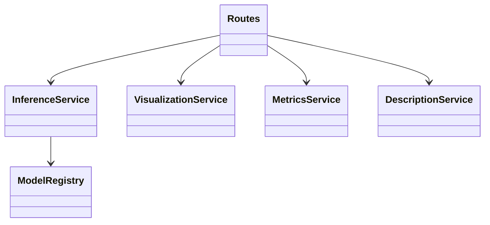

# ADE20K公式Mask2Former 可視化Webサービス 実装計画（最終版）

## 1. 目的と位置付け

本計画の目的は、以下を短期間で明確に証明すること。

1. 公式学習済みモデル（ADE20K）を使ったセマンティックセグメンテーションの有効性を、**定性（可視化）+定量（数値）**で示せる。
2. `Next.js + React` と `FastAPI` による、実務で転用可能な評価基盤を自力で実装できる。
3. 推論結果をLLM（Gemini）に接続し、アプリ価値（説明生成）まで拡張できる。

このプロジェクトは「建設図面の本番精度そのもの」を主張するものではなく、**モデル評価・分析を高速化するWeb基盤**として位置付ける。

---

## 2. スコープ

### 2.1 In Scope

- 公式モデル: `facebook/mask2former-swin-large-ade-semantic`
- 画像入力導線
  - テスト画像ギャラリー（スクロール選択）
  - 任意画像アップロード
- 可視化
  - 入力画像
  - 予測オーバーレイ
  - クラス別マスク一覧
- 定量表示
  - 上位クラス信頼度（Top-K）
  - クラス面積比（%）
  - 推論時間（ms）
- 生成機能
  - Gemini APIで場所/空間の紹介文を日本語生成
  - APIキー未設定時のフォールバック

### 2.2 Out of Scope

- 顧客図面での本格Fine-tuning
- 学習パイプライン構築（分散学習、長時間学習）
- 本番運用向け認証・監査ログ・課金

---

## 3. 技術スタック

- Frontend: `Next.js 15` `React 19` `TypeScript`
- Backend: `FastAPI` `Pydantic v2` `Uvicorn`
- ML: `PyTorch` `transformers`
- Image: `Pillow` `NumPy`
- LLM: `Gemini API`
- Env管理: `.env`（`GEMINI_API_KEY`, `MODEL_ID`）
- テスト
  - Backend: `pytest`（最小）
  - Frontend: `Playwright` or 手動E2E（時間優先）

---

## 4. ユーザー体験（UX）

### 4.1 想定ユーザー

- 面接官/開発者（モデル挙動を短時間で確認したい）

### 4.2 主要フロー

1. 画面表示時にテスト画像ギャラリーを読み込み。
2. ユーザーはスクロールして画像を選択（カード選択状態を強調表示）。
3. `推論する` 実行。
4. 結果として3ペインを表示。
   - 左: 入力画像
   - 中: 予測オーバーレイ
   - 右: クラス別マスク一覧
5. 同時に数値を表示。
   - Top-K信頼度
   - クラス面積比（%）
   - 推論時間（ms）
6. `説明文生成` 実行でGemini出力を表示。
7. 別画像を選択して比較を繰り返す。

### 4.3 UI要件

- ギャラリーは横スクロール（モバイルはスナップスクロール）
- ローディング中はボタンを無効化
- エラーメッセージはユーザー理解可能な日本語
- 推論結果は視覚情報と数値情報を同時表示

---

## 5. アーキテクチャ設計

### 5.1 全体構成

- Frontend: 表示とユーザー操作
- Backend API: 入出力の制御
- Inference層: Mask2Former推論
- Visualization/Metric層: 画像生成・統計算出
- Description層: Gemini連携

### 5.2 設計原則

- 疎結合: API層はサービス層へ依存し、モデル実装詳細を隠蔽
- 高凝集: 推論、可視化、指標計算、説明生成を責務分離
- 拡張性: 将来モデル追加時は `ModelRegistry` 更新のみで対応

---

## 6. API仕様（確定）

### 6.1 `GET /models`

- 目的: 使用可能モデル情報の取得
- 返却: `model_id`, `label_space`, `note`

### 6.2 `GET /test-images`

- 目的: ギャラリー表示用のテスト画像一覧
- 返却: `id`, `name`, `thumbnail_url`, `image_url`, `tags`

### 6.3 `POST /predict-by-id`

- 目的: テスト画像ID指定で推論
- 入力: `image_id`
- 返却:
  - `original_url`
  - `overlay_url`
  - `class_masks[]`
  - `top_classes[]`（信頼度）
  - `area_stats[]`（面積比）
  - `inference_ms`

### 6.4 `POST /predict`

- 目的: アップロード画像推論
- 入力: `multipart/form-data` (`file`)
- 返却: `POST /predict-by-id` と同形式

### 6.5 `POST /describe`

- 目的: 推論統計からGemini説明文を生成
- 入力: `top_classes[]`, `area_stats[]`
- 返却: `summary_ja`, `highlights[]`, `cautions[]`

---

## 7. 数値指標ロジック

### 7.1 上位クラス信頼度

- `Mask2Former` 出力からクラス確率を算出
- 画像全体での寄与を集約してTop-K表示
- 例: `wall 0.87`, `floor 0.79`, `window 0.63`

### 7.2 クラス面積比（%）

- 最終セグメンテーションのピクセル集計
- `class_pixels / total_pixels * 100`
- 例: `wall 32.4%`, `floor 28.1%`

### 7.3 可視化との関係

- 面積比上位クラスはマスク一覧で上に表示
- 信頼度と面積比が不一致のケースを失敗分析に活用

---

## 8. Gemini連携設計

### 8.1 目的

- モデル出力を人間が読める文章に変換し、業務利用の導線を示す

### 8.2 入力テンプレート

- 上位クラス（信頼度）
- 面積比
- 補助情報（推論時間、画像サイズ）

### 8.3 出力形式

- `summary_ja`: 空間の概要
- `highlights[]`: 注目点
- `cautions[]`: 注意点・誤認リスク

### 8.4 フォールバック

- `GEMINI_API_KEY` 未設定時
  - `/describe` は `503` + 明確な案内
  - 推論機能は通常動作

---

## 9. ファイル構造（最終）

```text
mask2former/
  IMPLEMENTATION_PLAN.md
  README.md
  backend/
    requirements.txt
    app/
      main.py
      api/
        routes.py
      core/
        config.py
      models/
        model_registry.py
      schemas/
        predict.py
        describe.py
      services/
        inference_service.py
        visualization_service.py
        metrics_service.py
        description_service.py
      static/
        test_images/
        results/
    tests/
      test_predict_api.py
  frontend/
    package.json
    tsconfig.json
    next.config.ts
    src/
      app/
        layout.tsx
        page.tsx
        globals.css
      components/
        TestImageCarousel.tsx
        ImageCard.tsx
        UploadForm.tsx
        ResultPanels.tsx
        ClassMaskList.tsx
        StatsTable.tsx
        DescriptionPanel.tsx
      hooks/
        useTestImages.ts
        useInference.ts
      lib/
        api.ts
      types/
        api.ts
```

---

## 10. 主要クラス/モジュール設計

### 10.1 Backend

- `ModelRegistry`
  - モデルID・ラベル空間・メタ情報管理
- `InferenceService`
  - モデルロード、前処理、推論、セグメンテーション生成
- `VisualizationService`
  - オーバーレイ画像、クラス別マスク画像生成
- `MetricsService`
  - Top-K信頼度、面積比算出
- `DescriptionService`
  - Gemini呼び出し、説明文整形
- `Routes`
  - API入出力のバリデーションとサービス呼び出し

### 10.2 Frontend

- `TestImageCarousel`
  - スクロール選択、選択状態管理
- `UploadForm`
  - 任意画像アップロード
- `ResultPanels`
  - 入力/オーバーレイ/マスク一覧表示
- `StatsTable`
  - 信頼度・面積比表示
- `DescriptionPanel`
  - 説明文生成ボタンと結果表示
- `useInference`
  - 推論系API呼び出しを集約
- `useTestImages`
  - テスト画像取得とキャッシュ

### 10.3 関係図（要点）



---

## 11. 実装タスク（優先順）

### Phase 1: Backend基盤

1. `ModelRegistry` と `InferenceService` 実装
2. `VisualizationService` 実装（overlay + class masks）
3. `MetricsService` 実装（Top-K + 面積比）
4. `/test-images`, `/predict-by-id`, `/predict` 実装

### Phase 2: Frontend UI

1. `TestImageCarousel` 実装
2. `ResultPanels`（3ペイン）実装
3. `StatsTable` 実装
4. アップロード導線統合

### Phase 3: Gemini統合

1. `DescriptionService` 実装
2. `/describe` 実装
3. `DescriptionPanel` 接続

### Phase 4: 仕上げ

1. エラーハンドリング整備
2. README更新
3. テスト画像3枚以上でデモ確認

---

## 12. 完了条件（Definition of Done）

- 3ペイン可視化が安定して動作
- Top-K信頼度、面積比、推論時間が表示される
- スクロールギャラリー選択で推論できる
- Gemini説明文が生成される（キーなしフォールバック含む）
- READMEに前提・限界・再現手順が記載されている

---

## 13. リスクと対策

- リスク: Macで推論遅延
  - 対策: 入力サイズ制限、ローディングUI、非同期処理
- リスク: Gemini API失敗
  - 対策: 明確なエラー表示、機能分離で推論継続
- リスク: 可視化だけでは説得力不足
  - 対策: 数値指標（Top-K、面積比）を必須表示

---

## 14. 面接での説明テンプレ

- 「公式重みを使って信頼性のある基準線を作り、可視化と数値でモデル挙動を説明できる基盤を実装しました。」
- 「スクロールで複数画像を即比較できるUIにして、失敗パターン分析を早く回せる設計にしています。」
- 「LLM連携は推論結果の解釈支援として分離実装し、今後の顧客向け機能に拡張しやすい構造にしました。」
